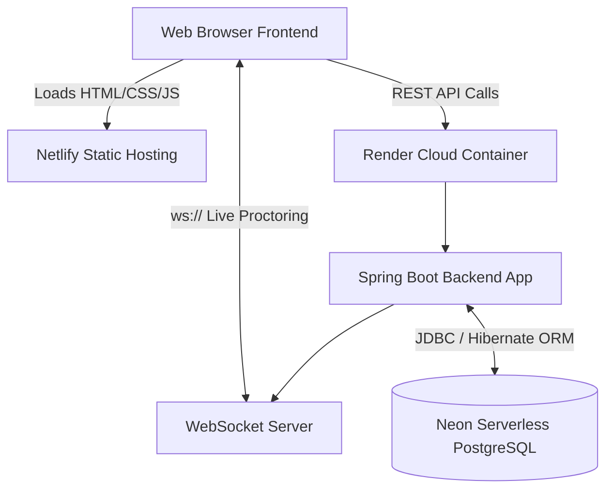

# 🎓 Multi-Tenant SaaS Exam Proctor Platform


A professional, multi-tenant Software-as-a-Service (SaaS) platform designed for educational institutions to conduct, manage, and proctor online examinations securely. Built with a robust **Java Spring Boot** backend, **PostgreSQL** database, and a highly responsive, modern frontend.

---

## ✨ Key Features

- **🏢 Multi-Tenant Architecture:** Supports multiple organizations (tenants) under a single deployment. Data is strictly isolated by `tenant_slug`.
- **🔐 Role-Based Access Control (RBAC):**
  - `SUPER_ADMIN`: Manages platform-wide settings and onboards new organizations.
  - `ORG_ADMIN`: Manages exams, students, and proctoring for their specific institution.
  - `STUDENT`: Takes exams, views past results, and receives live notifications.
- **📝 Comprehensive Exam Management:** Create Multiple-Choice Questions (MCQs) with support for decimal-based positive and negative marking.
- **⚡ Real-Time WebSockets:** Live messaging and system notifications between admins and students during active exams.
- **🎨 Modern UI/UX:** A sleek, accessible, and responsive vanilla HTML/CSS/JS frontend without the bloat of heavy frontend frameworks.
- **☁️ Cloud-Native Deployment:** Containerized with Docker and optimized for deployment on Render and Netlify.

---

## 🏗️ System Architecture



---

## 🛠️ Technology Stack

**Backend:**
- Java 21
- Spring Boot 3.2
- Spring Data JPA (Hibernate ORM)
- Spring Security (JWT Authentication)
- Spring WebSockets

**Frontend:**
- HTML5, CSS3, Vanilla JavaScript
- Fetch API for RESTful integration
- Custom CSS variables for dynamic theming (Dark/Light mode ready)

**Database & Deployment:**
- PostgreSQL (Hosted on Neon)
- Render (Backend Docker Container Hosting)
- Netlify (Frontend Hosting)

---

## 🚀 Local Development Setup

### Prerequisites
- JDK 21+
- PostgreSQL 15+
- Maven

### 1. Database Configuration
Create a local PostgreSQL database named `proctor_saas`.

### 2. Backend Setup
Navigate to the backend directory and run the Spring Boot application:
```bash
cd backend
mvn clean install -DskipTests
mvn spring-boot:run
```
The backend will automatically start on `http://localhost:8080`. Hibernate will automatically generate the required database tables via the `update` DDL strategy.

### 3. Frontend Setup
Navigate to the frontend directory and serve the static files. You can use any static file server (e.g., VS Code Live Server or Python):
```bash
cd frontend
python -m http.server 3000
```
Open `http://localhost:3000` in your browser. The frontend is configured to automatically route API calls to `localhost:8080` when run locally.

---

## 📚 Database Schema Overview
The platform uses a highly normalized relational database structure:
- `organizations`: Tenant data.
- `users`: Authenticated accounts tied to an organization.
- `exams` & `questions` & `options`: Hierarchical exam creation data.
- `exam_submissions` & `submission_details`: Tracks student progress and granular answer selections.

---

## 🤝 Contributing
Contributions, issues, and feature requests are welcome! Feel free to check the [issues page](https://github.com/TusharS230/exam-proctor-system/issues).

## 📄 License
This project is licensed under the MIT License - see the [LICENSE](LICENSE) file for details.
